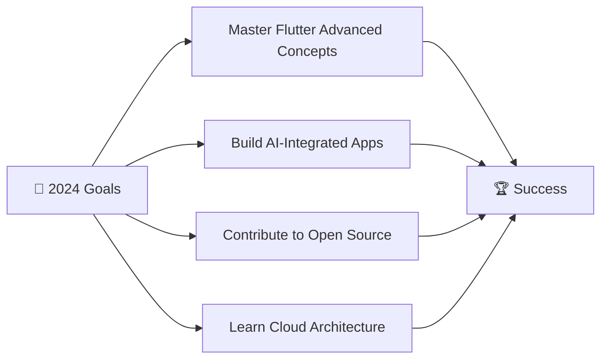

#  Hi, I'm Saurabh!

<div align="center">
  
[](https://git.io/typing-svg)

</div>

---

## 🚀 About Me


```typescript
const saurabh = {
    location: "India 🇮🇳",
    currentFocus: "Flutter Development & AI Integration",
    learning: ["Machine Learning", "Backend Architecture", "DSA"],
    hobbies: ["🎮 Gaming", "📚 Tech Blogs", "🎵 Music"],
    funFact: "I debug with console.log and I'm not ashamed! 😄"
};
```

- 🔭 Currently working on **AI-powered Flutter applications**
- 🌱 Learning **Machine Learning, Advanced Backend Development**
- 👯 Open to collaborate on **Flutter, AI/ML, and Open Source projects**
- 💬 Ask me about **Flutter, Firebase, Python, AI/ML, C++**
- 📫 How to reach me: **[Your Email]**
- ⚡ Fun fact: **I can code for hours with just coffee and good music!**

---

## 🛠️ Tech Arsenal

<div align="center">

### 🎨 Frontend Development


### ⚙️ Backend Development


### 🧠 AI/ML & Data Science


### 🗃️ Databases


### 🛠️ Tools & Technologies


</div>

---

## 📊 GitHub Analytics

<div align="center">
  


</div>

---

## 🏆 GitHub Trophies

<div align="center">
  
[](https://github.com/ryo-ma/github-profile-trophy)

</div>

---

## 📈 Contribution Activity

<div align="center">
  
[](https://github.com/ashutosh00710/github-readme-activity-graph)

</div>

---

## 🚀 Featured Projects

<div align="center">

[](https://github.com/Dev-Saurabhraj/arogya_sathi_mobile_app)
[](https://github.com/Dev-Saurabhraj/CrowdSense)

</div>

---

## 🐍 Contribution Snake

<div align="center">
  


</div>

---

## 🎯 Current Goals


```mermaid
graph LR
    A[🎯 2024 Goals] --> B[Master Flutter Advanced Concepts]
    A --> C[Build AI-Integrated Apps]
    A --> D[Contribute to Open Source]
    A --> E[Learn Cloud Architecture]
    B --> F[🏆 Success]
    C --> F
    D --> F
    E --> F
```

---

## 📱 Connect With Me

<div align="center">

[](https://linkedin.com/in/your-linkedin)
[](https://twitter.com/your-twitter)
[](https://instagram.com/your-instagram)
[](https://your-portfolio.com)
[](mailto:saurabhraj2509@gmail.com)

</div>

---

<div align="center">

### 💭 Quote of the Day
[](https://github.com/piyushsuthar/github-readme-quotes)

### 👀 Profile Views


### ⭐ Thanks for visiting!
**Happy Coding!** 🚀

</div>

---

<div align="center">
  
</div>
